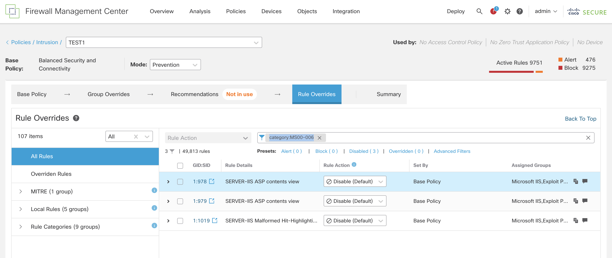

# IPS_rule_updater

This tool shows how a script can modify Snort 3 IPS rule actions.  

  
# How to install:

  Copy these files into a working directory and make sure `requests` is an installed python library:
  
  `pip install requests` 
  

  The `fmc_config.py` file contains the FMC parameters. 
  Please modify according to Your environment!  

   
  This script will modify the the intrustion rules of an IPS policy using the specified filter.  

# How to use:

  Please run this python from CLI: 
  
  `python3 ips_rule_updater.py -p TEST1 -f 'lsp:lsp rel 20231213 1558' -a ALERT -v`

  where: 

  -p    the name of the IPS policy, like TEST1

  -f    the string of the filter, like 'lsp:lsp rel 20231213 1558' or 'category:MS00-006'

  
Since there may be spaces in the filter, please use apostrophes at the beginning and end of the text!  
In principle, all filters accepted by the FMC GUI can be used, as shown in the picture:

    
 -a    the name of the requested action, like ALERT, BLOCK, ...    

 -v    verbose for debugging
